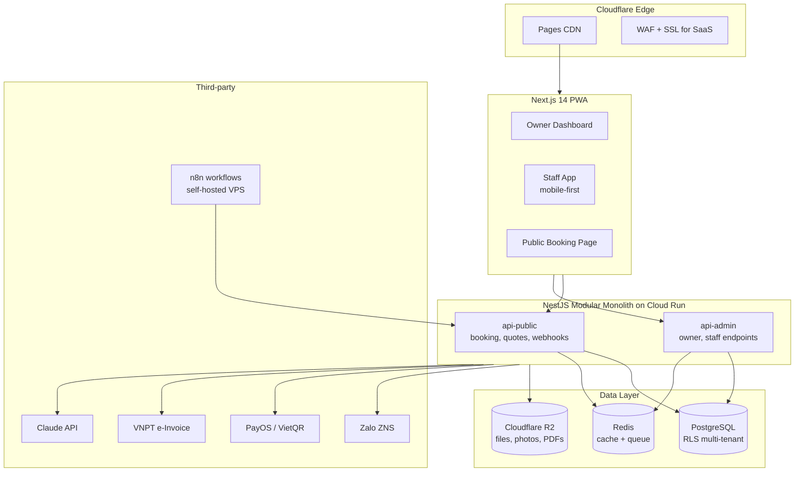

<div align="center">

# ServiceOS

**A multi-tenant SaaS operating system for Vietnamese micro service businesses.**

*"Customers book — technicians focus on the craft — the system handles the rest."*

[]()
[](LICENSE)
[]()
[]()

[Problem](#-the-problem) · [Solution](#-the-solution) · [Architecture](#-architecture) · [Tech Stack](#-tech-stack) · [Engineering Highlights](#-engineering-highlights) · [Roadmap](#-roadmap)

</div>

---

## The Problem

In Vietnam, **5+ million micro service businesses** (home technicians, beauty salons, fitness coaches, tutors) run their operations on **Zalo messages and Excel spreadsheets**. Existing software fails them in three ways:

| Existing option | Why it fails micro service businesses |
|---|---|
| Goods-oriented POS (KiotViet, Sapo, MISA) | Built for inventory, not time-slots and field work |
| Enterprise vertical software (Myspa, MonaEdu, CMMS) | Expensive, complex, overkill for a 2-5 person shop |
| Zalo + Excel + memory | Missed appointments, lost customer history, unprofessional image |

The result: small operators **lose 20-30% of potential revenue** to forgotten follow-ups, double-booked slots, and customers who never return because no one reminded them.

## The Solution

**ServiceOS** is a mobile-first, multi-tenant SaaS with a **plugin architecture** that adapts to three verticals from a single codebase:

- **Home technicians** — HVAC, repair, maintenance with GPS dispatch, asset history, warranty tracking
- **Beauty & wellness** — spa, nail, gym, clinic with slot booking, membership packages, room/chair resources
- **Education & consulting** — tutors, coaches, advisors with session tracking, deliverables, retainers

Plus a **Vietnamese tax module** that helps unincorporated business owners (hộ kinh doanh) estimate, file, and pay taxes without an accountant.

### What makes it different

- **60-second booking** — public booking page, no customer account required
- **Mobile-first staff app** — 80×80px touch targets, GPS check-in, offline mode, camera-integrated checklists
- **Plugin per industry** — same core, different feature surface
- **AI-assisted** — Claude API summarizes service history and suggests quotes from rough field notes
- **Zalo-native** — automatic ZNS reminders, quote approval via Zalo link, no app install required for customers

---

## Architecture

### High-level system



### Clean Architecture per module

Every domain module follows the same four-layer structure with strict dependency rules enforced by ESLint:

```
modules/jobs/
├─ domain/          # Entities, value objects, domain events (pure)
├─ application/     # Use-cases + port interfaces
├─ infrastructure/  # Prisma repos, HTTP clients, adapter implementations
└─ presentation/    # Controllers, DTOs, WebSocket gateways
```

**Dependency rule**: `presentation → application → domain ← infrastructure`. Domain never imports anything else. Infrastructure implements ports defined in application.

### Cross-module communication

Modules **never call each other directly**. All cross-cutting concerns go through an internal event bus:

```typescript
// JobsModule publishes a domain event
this.eventBus.publish(new JobCompletedEvent({ jobId, customerId, completedAt }));

// InvoiceModule, NotificationModule, AiModule each subscribe independently
@OnEvent('job.completed')
async onJobCompleted(event: JobCompletedEvent) { /* ... */ }
```

This is what makes the **modular monolith → microservices** migration tractable later: swap `EventEmitter2` for NATS/Pub-Sub and the business code doesn't change.

---

## Tech Stack

| Layer | Choice | Rationale |
|---|---|---|
| **Frontend** | Next.js 14 (App Router) + PWA + Service Worker | Mobile-first, offline-capable staff app, edge-rendered booking page |
| **Backend** | NestJS (TypeScript) | Module-per-domain, native DI, decorator-based pipeline |
| **Database** | PostgreSQL 16 + Prisma | ACID for financial data; multi-tenancy via Row-Level Security |
| **Cache / Queue** | Redis + BullMQ | Slot locking, async jobs, rate limiting |
| **Automation** | n8n (self-hosted) | Visual workflows for reminders, follow-ups — editable without code deploys |
| **AI** | Claude API (Haiku + prompt caching) | Cost-optimized assistant for quote suggestions, history summaries |
| **Payments** | VietQR + PayOS | Vietnamese-native, low fees, instant confirmation |
| **Notifications** | Zalo ZNS + SMS fallback | 95% of Vietnamese small-business customers use Zalo |
| **E-Invoice** | VNPT eInvoice | Compliant with Vietnamese tax authority requirements |
| **Hosting** | GCP Cloud Run + Cloudflare Pages | Scale-to-zero economics, edge-cached frontend |
| **Storage** | Cloudflare R2 | Zero egress fees vs GCS |
| **IaC** | Terraform | Reproducible environments, drift detection |
| **CI/CD** | GitHub Actions + OIDC → GCP | Keyless deploys, plan-on-PR |
| **Monorepo** | Turborepo + pnpm | Incremental builds, shared packages |

---

## Engineering Highlights

This section is for engineers and recruiters who want to see *how* the system is built, not just *what* it does.

### 1. Multi-tenant isolation via Row-Level Security

Every tenant's data is enforced at the database layer, not just the application layer. The application sets a session variable per transaction; Postgres policies do the rest.

```sql
CREATE POLICY tenant_isolation ON jobs
  USING (tenant_id = current_setting('app.tenant_id')::uuid);
```

A dedicated integration test suite asserts that **tenant A can never read tenant B's data** under any code path — including via raw SQL.

### 2. Plugin architecture for vertical adaptation

Industry-specific modules (memberships, assets, sessions, tax) are toggled per-tenant via `tenants.settings` JSONB:

```typescript
@RequirePlugin('membership')
@Controller('memberships')
export class MembershipController { /* ... */ }
```

The `PluginGuard` returns 404 for tenants that haven't enabled the plugin — preventing feature leakage on lower tiers.

### 3. Concurrent slot booking without oversell

When 50 customers try to book the same time slot simultaneously, exactly one wins. Implemented with Redis `SETNX` distributed locks + Postgres serializable transactions:

```typescript
async createBooking(slotId: string, customer: Customer) {
  const lock = await this.redis.setNX(`slot:${slotId}:lock`, '1', { EX: 10 });
  if (!lock) throw new SlotTakenException();
  return this.prisma.$transaction(async (tx) => {
    const slot = await tx.timeSlot.findUnique({ where: { id: slotId, status: 'AVAILABLE' }});
    if (!slot) throw new SlotTakenException();
    /* ... create booking, update slot ... */
  }, { isolationLevel: 'Serializable' });
}
```

Verified with a k6 load test that fires 50 concurrent requests at the same slot.

### 4. Idempotent payment webhooks

Payment providers retry webhooks on network failure. Without idempotency, the same payment gets recorded twice and customers get spammed with thank-you messages. Solution:

```typescript
async handlePayOSWebhook(payload: PayOSWebhookPayload, signature: string) {
  this.verifyHmacSignature(payload, signature);  // reject forgeries
  const key = `webhook:payos:${payload.transactionId}`;
  const isFirst = await this.redis.set(key, '1', { NX: true, EX: 86400 });
  if (!isFirst) return { status: 'already_processed' };
  await this.paymentService.recordPayment(payload);
}
```

### 5. AI cost control with prompt caching

Claude API calls would bankrupt the project at scale. Mitigations:
- **Haiku model** for most tasks — 10× cheaper than Sonnet
- **Prompt caching** on the system prompt — 90% cost reduction on repeat calls
- **Per-tenant quotas** enforced by `AiQuotaGuard` (Redis counter, monthly reset)
- **Gated to PRO tier only** — never offered on free plan

### 6. Offline-first staff app

Field technicians lose mobile signal in basements, elevators, remote sites. The PWA caches their day's jobs locally via Service Worker, queues completion events in IndexedDB, and syncs when connectivity returns. No "please reconnect" errors.

### 7. Public booking page with no account required

A customer should book a service in **under 60 seconds** without creating an account. The page is statically rendered at the edge, fetches available slots from a public API, and creates a passwordless customer record keyed on phone number.

---

## Project Structure

```
service-os/
├─ apps/
│  ├─ web/                # Next.js 14 — Owner Dashboard + Staff PWA + Booking Page
│  └─ api/                # NestJS — modular monolith
│     └─ src/modules/
│        ├─ tenant/       # Multi-tenancy, onboarding
│        ├─ auth/         # JWT, RBAC, TenantGuard
│        ├─ jobs/         # Work order lifecycle (core)
│        ├─ customers/    # Customer + asset history
│        ├─ booking/      # Slot management, public booking
│        ├─ quotation/    # PDF generation, Zalo approval flow
│        ├─ invoice/      # VNPT e-invoice integration
│        ├─ payment/      # VietQR + PayOS webhook
│        ├─ staff/        # Dispatch, GPS check-in
│        ├─ membership/   # Plugin: package cards (Beauty/Edu)
│        ├─ assets/       # Plugin: customer devices (Technical)
│        ├─ sessions/     # Plugin: tutoring sessions (Education)
│        ├─ tax/          # Plugin: Vietnamese tax filing assistance
│        ├─ ai/           # Claude API integration
│        ├─ reminders/    # n8n workflow triggers
│        ├─ notifications/# Zalo ZNS + SMS gateway
│        └─ reports/      # Revenue, retention, performance
├─ packages/
│  ├─ types/              # Shared TypeScript domain types
│  ├─ ui/                 # Component library (Shadcn-based)
│  ├─ config-eslint/      # Architecture boundary enforcement
│  └─ utils/              # date, currency, vn-tax helpers
├─ infra/
│  ├─ terraform/          # GCP infrastructure as code
│  ├─ docker/             # Local dev compose
│  └─ n8n/workflows/      # Versioned automation workflows
├─ docs/
│  ├─ adr/                # Architecture Decision Records
│  └─ runbooks/           # Incident response playbooks
└─ .github/workflows/     # CI/CD pipelines
```

---

## Getting Started

> Status: in active development. Public preview coming after MVP. The instructions below describe the intended developer setup.

### Prerequisites

- Node.js 20 LTS, pnpm 9, Docker Desktop
- Google Cloud SDK (for deployment)
- A Postgres-compatible database (Supabase free tier works for MVP)

### Local development

```bash
# 1. Clone and install
git clone https://github.com/<your-username>/service-os.git
cd service-os
pnpm install

# 2. Start local infrastructure
docker compose -f infra/docker/docker-compose.yml up -d
# starts: postgres, redis, n8n, mailhog

# 3. Copy environment template
cp .env.example .env
# edit .env with your local values

# 4. Migrate and seed the database
pnpm db:migrate
pnpm db:seed       # creates 3 demo tenants (technical, beauty, education)

# 5. Run dev servers
pnpm dev
# web:    http://localhost:3000
# api:    http://localhost:4000
# n8n:    http://localhost:5678
```

### Testing

```bash
pnpm test              # unit tests (Vitest)
pnpm test:integration  # integration tests (Testcontainers)
pnpm test:e2e          # E2E tests (Playwright)
pnpm test:load         # load tests (k6)
```

---

## Roadmap

The project is being built in 5 phases mapped to a Fresher → Senior learning path.

| Phase | Focus | Key skills |
|---|---|---|
| 1. Foundation | Multi-tenant auth, jobs CRUD, Owner Dashboard | RLS, NestJS modules, Prisma multi-tenancy |
| 2. Customer-facing | Booking flow, slot management, Zalo reminders | Calendar logic, distributed locking, n8n |
| 3. Money | Quotations, VietQR, e-invoice, customer assets | PDF generation, webhook idempotency, HMAC |
| 4. Intelligence | Staff dispatch (GPS), AI assist, memberships, analytics | Geospatial queries, event-driven sync, prompt engineering |
| 5. Production-ready | PWA offline, security audit, load testing, observability | Service Worker, OWASP, k6, OpenTelemetry |

Detailed milestones live in [the project board](https://github.com/users/<your-username>/projects).

---

## Architecture Decision Records

Significant design decisions are documented as ADRs in [`docs/adr/`](docs/adr/). Highlights:

- **ADR-001** — Why modular monolith over microservices at this scale
- **ADR-002** — Row-Level Security as the multi-tenancy primitive
- **ADR-003** — Internal event bus for cross-module communication (and how it enables future microservices)
- **ADR-004** — Self-hosted n8n vs. coding cron jobs in the backend
- **ADR-005** — Claude API gated behind paid tier with prompt caching

---

## Skills Demonstrated

For recruiters: this project exercises the following skills end-to-end.

<table>
<tr><td><strong>Frontend</strong></td><td>
Next.js 14 App Router · React Server Components · PWA with Service Worker · Offline-first state · IndexedDB sync · Tailwind CSS · Shadcn UI · Web Push · Mobile-first responsive · Accessibility (WCAG 2.1 AA) · i18n with next-intl · Performance budgets (Lighthouse)
</td></tr>
<tr><td><strong>Backend</strong></td><td>
NestJS modular architecture · Clean Architecture (4-layer) · SOLID + DDD-lite · CQRS-style use cases · Internal event bus · BullMQ background jobs · WebSocket gateways · OpenAPI auto-generation · Zod runtime validation · JWT auth with refresh rotation · RBAC + tenant guards · Rate limiting · Idempotent webhook handling · HMAC signature verification
</td></tr>
<tr><td><strong>Database</strong></td><td>
PostgreSQL 16 · Prisma ORM · Multi-tenant Row-Level Security · Serializable transactions · Materialized views for read models · Multi-file Prisma schemas per bounded context · Forward-only migrations · Backfill scripts · Database seeding for demo
</td></tr>
<tr><td><strong>Cloud & DevOps</strong></td><td>
Google Cloud Platform (Cloud Run, Memstore, Compute Engine, Secret Manager, Artifact Registry) · Cloudflare (Pages, R2, SSL for SaaS, WAF) · Terraform IaC · GitHub Actions CI/CD · OIDC keyless deploys · Multi-environment (staging/prod) · Blue-green deploys via Cloud Run revisions · Cost optimization (scale-to-zero)
</td></tr>
<tr><td><strong>Quality & Testing</strong></td><td>
Test pyramid discipline · Vitest unit · Testcontainers integration · Playwright E2E · k6 load testing · Pact contract testing · OWASP ZAP scans · Multi-tenant isolation tests · Concurrency tests · Golden master testing for tax calculations
</td></tr>
<tr><td><strong>Observability</strong></td><td>
OpenTelemetry tracing · Sentry error tracking · Grafana Cloud (Loki logs + metrics) · SLO + error budget tracking · Custom business metrics · Distributed tracing across event bus
</td></tr>
<tr><td><strong>Integrations</strong></td><td>
Anthropic Claude API (with prompt caching) · Zalo Official Account ZNS · PayOS payment gateway · VNPT e-Invoice · VietQR · n8n workflow automation · OAuth flows · Webhook security
</td></tr>
<tr><td><strong>Architecture & Design</strong></td><td>
Hexagonal/Ports & Adapters · Plugin architecture (industry verticals) · Modular monolith with microservices migration path · Domain events · Saga-ready workflow design · Architecture Decision Records · UX for non-technical users · Performance budgeting · Vietnamese-market product design
</td></tr>
</table>

---

## Contributing

This is currently a solo project for learning and bootstrapping a business. Issues, discussions, and feedback are welcome. If you're a Vietnamese small business owner who'd like to try the beta, please open a discussion.

## License

[MIT](LICENSE) — feel free to learn from the patterns and code. The product, brand, and tenant data are not licensed.

## Contact

Open an issue or start a discussion on this repository. For commercial or recruitment inquiries, please reach out via the contact information on my GitHub profile.

---

<div align="center">

*Built with the conviction that small businesses deserve enterprise-grade software,*
*and that great software lifts communities, not just balance sheets.*

</div>